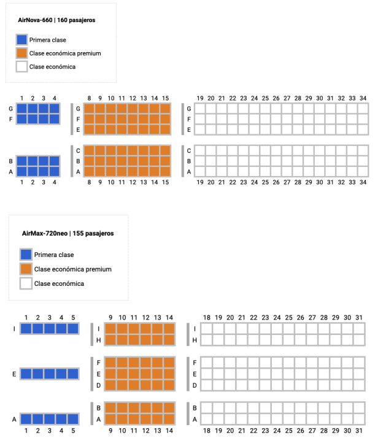
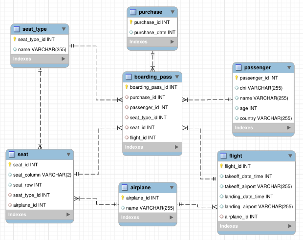

# Simulacion check-in Aerolinea

Programa que realice esta simulación de check-in.

API REST que tiene un endpoint para consultar por ID de vuelo y retorna información del vuelo (origen, destino, fecha de salida y llegada), avión, lista de pasajeros con información como nombre, apellido, edad, id de asiento, tipo de asiento, id boleto, etc.

Consta de 2 tipos de aviones con una determinada cantidad de asientos, este programa se encarga de establecer asientos a cada pasajero según si "clase de asiento" (premium, premium económico, económico).



La base de datos consta del siguiente esquema.



Una vez realizada la operación de establecimiento de asientos, se retorna una respuesta con los datos actualizados de cada pasajero.

El directorio **datos_DB** contiene la información usada para este proyecto.


## Consideraciones

* Una compra puede tener muchas tarjetas de embarque asociadas, pero estas tarjetas pueden no tener un asiento asociado, siempre tendrá un tipo de asiento, por lo tanto, al retornar la simulación del check-in se debe asignar el asiento a cada tarjeta de embarque.

* Todo pasajero menor de edad debe quedar al lado de al menos uno de sus acompañantes mayores de edad (se puede agrupar por el id de la compra).

* Si una compra tiene, por ejemplo, 4 tarjetas de embarque, tratar en lo posible que los asientos que se asignen estén juntos, o queden muy cercanos (ya sea en la fila o en la columna).

* Si una tarjeta de embarque pertenece a la clase “económica”, no se puede asignar un asiento de otra clase.

* La respuesta de la API deben ser transformados a *CamelCase*.

* El usuario debe tener permisos de solo lectura.


---

>
> Importante:
>
> Los datos son ficticios, si por alguna casualidad se presenta algún problema con alguien, deje su inquietud en la sección de *Issues* del repositorio.
>
> Proyecto de finalidad práctica y/o educativa.
>

---

# Requisitos

* Python 3.8+

* Poetry - entorno virtual, permite administrar dependencias y paquetes Python.

  Instalación Poetry

  ```python
  pip install poetry
  ```

* Variables de entorno

  ```  
  aeroDB='airline'
  aeroUser='aeroUser'
  aeroPass='aerouserpass'
  aeroHost='localhost'
  aeroPort=3306
  aeroKey='*310*7fe2f+5!888hqumt_9n$9y$&!)e-_psnv43dvuj+#+*mr'
  aeroDebug='False'
  ```


# Instrucciones

* Clonar o descargar el repositorio.

  ```bash
  git clone https://github.com/kurotom/Simulacion_check-in_Aerolinea.git
  ```

* Iniciar entorno virtual.

  ```bash
  poetry shell
  ```

  ---

  Si tiene otra versión Python 3.8+ funcionará igualmente, ahora, si quiere usar la versión 3.8, ejecutar el siguiente comando.

  ```bash
  poetry env use python3.8
  ```

  ---


* Ejecutar script (Linux), actualizará *pip*, instalará dependencias Python, preparará ficheros estáticos.

  ```bash
  ./build.sh
  ```

* Ejecutar el servidor.

  ```bash
  python manage.py runserver
  ```


# Endpoint

Retorna información del vuelo y lista de pasajeros, donde, `{vueloID}` corresponde al numero de vuelo.

```
/flights/{vueloID}/passengers
```

# Documentación API

```
/doc
```

Esta ruta muestra una documentación interactiva de la API.


# Explicación de solución

## Al recibir una petición correcta

1. Busca si existe o no el id del vuelo consultado, prepara los datos (serializa). Busca los ticket de vuelo por su *vueloId* y se separan por el tipo de asiento, premium, premium económico y económico.

2. Obtiene los datos de todos los pasajeros por su id entregado en el ticket, realizado por la función `dataPassenger`.

3. Luego se procede con la ubicación de los pasajeros en los asientos del avión, realizado principalmente por la función `establecerAsientos`, en general, esta función separa los pasajeros en grupos por su id de compra de ticket, los pasajeros del mismo grupo se ordenan dependiendo dejando primero los que si tienen asignado un asiento.

  Estos grupos de pasajeros son los primeros en asignarles asientos.

  Los grupos de pasajeros que no tienen asientos se separan del resto, y son tratados aparte.

4. Los grupos sin asientos, se ordenan de mayor a menor según la cantidad de pasajeros del grupo.

  Se consulta por los asientos restantes disponibles y se comprueba que los integrantes de cada grupo se establezcan en la misma fila sin exceder el límite de cada columna de asientos.

  A cada pasajero asignado a una posición, se consulta por la identificación del asiento y esta ID se asigna a los datos del pasajero.

5. Una vez, asignados todos los pasajeros, se prepara la respuesta de la API, esta se ajusta al formato requerido y los datos son enviados al cliente.


## Al recibir una petición incorrecta

Responde con una 404 retornando una *data* vacía, o con un 400.

Se programó para manejar los crashes o errores 500 para tener una respuesta.


## Para finalizar

Existen varias funciones dentro del fichero `views.py` del directorio `api` que contienen *docstrings* que describen brevemente el trabajo que realiza.
